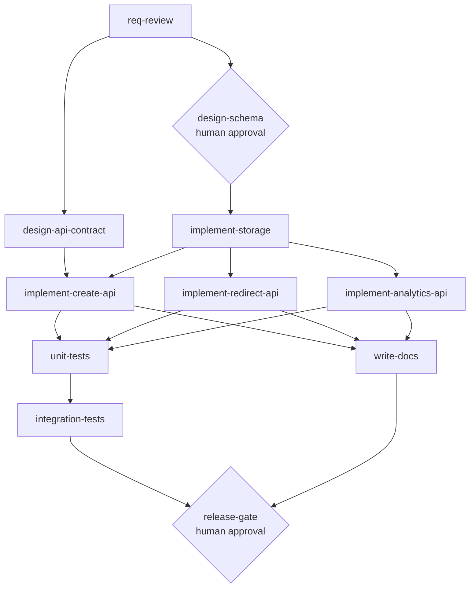

# Task Decomposition

## Methodology

Each functional/non-functional requirement from `docs/requirements.md` is mapped to one or
more graph nodes, grouped into SDLC stages (`requirements`, `design`, `implementation`,
`testing`, `documentation`, `release`). Nodes declare `depends_on` explicitly; nodes whose
dependencies are all satisfied at the same time are eligible to run **in parallel** — the
graph shape itself expresses sequencing, not a separate schedule.

This is authored as data (`src/scenarios/*.json`), not prose, so it is the literal input the
orchestration engine (Phase 3) executes — decomposition and orchestration share one artifact
instead of the plan drifting from what actually runs.

## Node schema

| Field | Meaning |
|---|---|
| `id` | Unique node identifier |
| `stage` | SDLC stage this node belongs to |
| `description` | Human-readable intent |
| `depends_on` | List of node ids that must reach `passed` before this node is eligible |
| `action` | Identifier resolved by the engine to a registered step function (Phase 3+) |
| `requires_approval` | If true, engine pauses at a human-approval gate before running the node |
| `retry.max_attempts` / `retry.backoff_seconds` | Bounded retry policy for this node |
| `rollback_action` | Identifier of a compensating action if the node fails after exhausting retries, or is rolled back after a downstream failure |

## Greenfield graph (`src/scenarios/greenfield.json`)

**Sequential paths**: `req-review -> design -> implement-storage` must happen in order —
storage can't be built before the schema exists.

**Parallel paths with synchronization**:
- `design-schema` and `design-api-contract` both only depend on `req-review` — run in
  parallel, no shared state.
- `implement-redirect-api`, `implement-analytics-api`, and (after storage) `implement-create-api`
  run in parallel once `implement-storage` passes — they touch independent endpoints.
- `unit-tests` is a **join node**: it depends on all three implementation nodes and only
  becomes eligible once all three have passed.
- `write-docs` runs in parallel with the testing branch (`unit-tests` -> `integration-tests`)
  since documentation doesn't depend on test results, only on implementation being done.
- `release-gate` is a second join: it depends on both the testing branch and the docs branch,
  and additionally requires human approval — a high-impact action (this is what ships) is
  gated even though every upstream node already passed.
- `design-schema` also requires human approval — not because the graph author asked for it,
  but because the engine's `require_approval_on_schema_changes` policy (Phase 3) forces it on
  any node touching the schema, regardless of how the graph JSON is written. Omitting
  `requires_approval` there is a policy violation, not a valid configuration.

**Bounded retry**: implementation and testing nodes retry up to 2 times with backoff before
being marked failed and triggering `rollback_action`. `release-gate` has no retry — a failed
release readiness check is a stop-and-fix condition, not something to blindly retry.

## Brownfield and ambiguous graphs

`src/scenarios/brownfield.json` (Phase 5) and `src/scenarios/ambiguous.json` (Phase 6) are
written after the greenfield service exists, since they modify or extend it — codebase
reasoning about *impacted* nodes is part of what those phases demonstrate.
